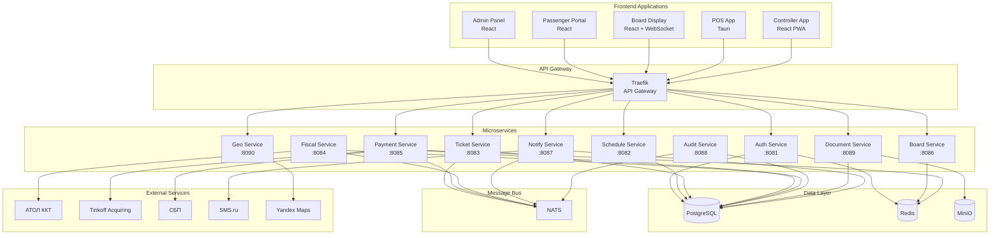
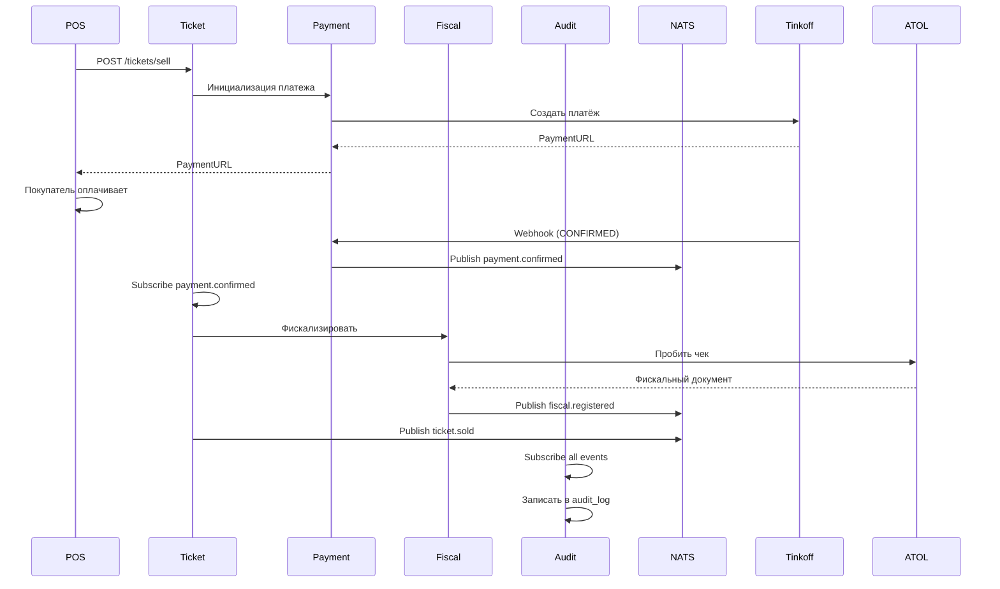
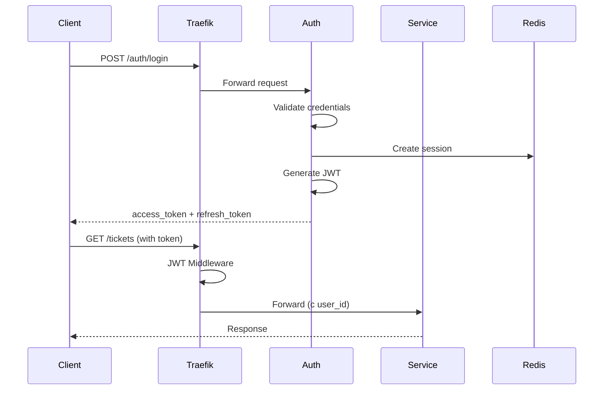

# Архитектура Вокзал.ТЕХ

## Обзор

Вокзал.ТЕХ построен на современной микросервисной архитектуре с использованием event-driven подхода.

## Высокоуровневая архитектура



## Микросервисы

### Auth Service (Port 8081)

**Ответственность:**
- Аутентификация пользователей
- Выдача и обновление JWT токенов
- Управление ролями (RBAC)
- Session management

**Технологии:**
- Go + Gin
- PostgreSQL
- Redis (sessions)
- JWT-Go

**API Endpoints:**
- `POST /v1/auth/login`
- `POST /v1/auth/refresh`
- `POST /v1/auth/logout`
- `GET /v1/auth/me`

### Schedule Service (Port 8082)

**Ответственность:**
- CRUD маршрутов
- Управление расписанием
- Создание и отмена рейсов
- Поиск рейсов

**Технологии:**
- Go + Gin
- PostgreSQL
- NATS (events)

**API Endpoints:**
- `GET /v1/routes`
- `POST /v1/routes`
- `GET /v1/schedules`
- `GET /v1/trips/search`

### Ticket Service (Port 8083)

**Ответственность:**
- Продажа билетов
- Возврат билетов
- Блокировка возвратов
- Отметка посадки

**Технологии:**
- Go + Gin
- PostgreSQL
- Redis (locks)
- NATS (events)

**API Endpoints:**
- `POST /v1/tickets/sell`
- `POST /v1/tickets/:id/refund`
- `POST /v1/tickets/:id/board`

### Payment Service (Port 8085)

**Ответственность:**
- Инициализация платежей
- Tinkoff Acquiring
- СБП (QR коды)
- Webhooks от провайдеров

**Технологии:**
- Go + Gin
- PostgreSQL
- NATS (events)

**Интеграции:**
- Tinkoff Acquiring API v2
- СБП (Система быстрых платежей)

### Fiscal Service (Port 8084)

**Ответственность:**
- Фискализация продаж
- Z-отчёты
- Интеграция с АТОЛ ККТ
- История фискальных операций

**Технологии:**
- Go + Gin
- PostgreSQL
- АТОЛ Fiscal Driver

### Board Service (Port 8086)

**Ответственность:**
- WebSocket сервер для табло
- Real-time обновления рейсов
- Кэширование данных
- Голосовые объявления

**Технологии:**
- Go + Gin
- Redis (кэш)
- WebSocket
- TTS (eSpeak)

### Notify Service (Port 8087)

**Ответственность:**
- SMS уведомления
- Email рассылка
- Telegram боты
- TTS объявления

**Технологии:**
- Go + Gin
- SMTP
- SMS.ru API
- Telegram Bot API

### Audit Service (Port 8088)

**Ответственность:**
- Логирование всех операций
- Соответствие 152-ФЗ
- Immutable audit log
- Отчёты по операциям

**Технологии:**
- Go + Gin
- PostgreSQL (append-only)

### Document Service (Port 8089)

**Ответственность:**
- Генерация ПД-2
- Кастомные шаблоны PDF
- Хранение документов
- Электронные билеты

**Технологии:**
- Go + Gin
- MinIO (хранение)
- PDF generation

### Geo Service (Port 8090)

**Ответственность:**
- Геокодирование адресов
- Расчёт расстояний
- Время в пути
- Интеграция с Yandex Maps

**Технологии:**
- Go + Gin
- Yandex Maps API

## Event-Driven Communication

### NATS Subjects

```
ticket.sold          — Билет продан
ticket.refunded      — Билет возвращён
ticket.boarded       — Пассажир сел в автобус

payment.confirmed    — Платёж подтверждён
payment.failed       — Платёж не прошёл

fiscal.registered    — Чек пробит
fiscal.report        — Z-отчёт сформирован

trip.created         — Рейс создан
trip.cancelled       — Рейс отменён
trip.departed        — Автобус отправился
```

### Event Flow Example: Продажа билета



## Data Layer

### PostgreSQL Schema

**stations**
- id, name, city, address, coordinates, timezone

**routes**
- id, from_station_id, to_station_id, distance_km, duration_minutes

**schedules**
- id, route_id, departure_time, arrival_time, days_of_week

**trips**
- id, schedule_id, bus_id, driver_id, departure_date, status

**tickets**
- id, trip_id, seat_id, price, passenger_name, status, sold_at

**payments**
- id, ticket_id, amount, method, provider, status, confirmed_at

**users**
- id, username, password_hash, role, station_id

**audit_logs** (append-only)
- id, user_id, action, resource, details, timestamp

### Redis Usage

```
sessions:{user_id}        — Сессии пользователей
locks:seat:{trip_id}:{id} — Блокировки мест
cache:trips:{date}        — Кэш рейсов
ws:clients:{board_id}     — WebSocket клиенты
```

### MinIO Buckets

```
documents    — PDF документы (билеты, отчёты)
templates    — Шаблоны документов
invoices     — Счета и акты
reports      — Z-отчёты, сводки
```

## Security Architecture

### Authentication Flow



### RBAC Matrix

| Endpoint | SuperAdmin | Admin | Cashier | Dispatcher | Controller | Viewer |
|----------|------------|-------|---------|------------|------------|--------|
| POST /tickets/sell | ✅ | ✅ | ✅ | ❌ | ❌ | ❌ |
| POST /tickets/refund | ✅ | ✅ | ✅ | ❌ | ❌ | ❌ |
| POST /tickets/board | ✅ | ✅ | ❌ | ❌ | ✅ | ❌ |
| POST /trips | ✅ | ✅ | ❌ | ✅ | ❌ | ❌ |
| POST /routes | ✅ | ✅ | ❌ | ✅ | ❌ | ❌ |
| GET /reports | ✅ | ✅ | ❌ | ✅ | ❌ | ❌ |
| GET /* | ✅ | ✅ | ✅ | ✅ | ✅ | ✅ |

## Deployment Architecture

### Production Setup

```
┌─────────────────┐
│   CloudFlare    │  ← DNS, CDN, DDoS Protection
└────────┬────────┘
         │
┌────────▼────────┐
│  Load Balancer  │  ← AWS ALB / nginx
└────────┬────────┘
         │
┌────────▼────────────────────────────┐
│        Kubernetes Cluster           │
│  ┌──────────────────────────────┐   │
│  │      Ingress (Traefik)       │   │
│  └──────────────┬───────────────┘   │
│                 │                    │
│  ┌──────────────▼───────────────┐   │
│  │   Services (Deployments)     │   │
│  │  • auth-service (3 replicas) │   │
│  │  • ticket-service (5)        │   │
│  │  • payment-service (3)       │   │
│  │  • etc...                    │   │
│  └──────────────────────────────┘   │
│                                      │
│  ┌──────────────────────────────┐   │
│  │     Stateful Sets            │   │
│  │  • PostgreSQL (Primary+2Rep) │   │
│  │  • Redis Cluster (6 nodes)   │   │
│  │  • NATS Cluster (3 nodes)    │   │
│  └──────────────────────────────┘   │
└──────────────────────────────────────┘
         │
┌────────▼────────┐
│   External      │
│   Services      │
│  • АТОЛ ККТ     │
│  • Tinkoff API  │
│  • SMS.ru       │
└─────────────────┘
```

## Scaling Strategy

### Horizontal Scaling
- Stateless сервисы масштабируются легко (3-10 реплик)
- Используем Kubernetes HPA (CPU/Memory based)

### Vertical Scaling
- PostgreSQL: read replicas для тяжёлых запросов
- Redis: cluster mode для высоких RPS

### Caching Strategy
- Redis для hot data (30 минут)
- CDN для статики (1 день)
- Browser cache для UI (1 час)

## Monitoring & Observability

### Prometheus Metrics
```
http_requests_total
http_request_duration_seconds
database_queries_total
nats_messages_published
```

### Distributed Tracing
- Jaeger для trace запросов
- Correlation IDs через все сервисы

### Logging
- Structured JSON logs
- Centralized в Loki
- Retention: 30 дней

---

© 2026 Вокзал.ТЕХ
